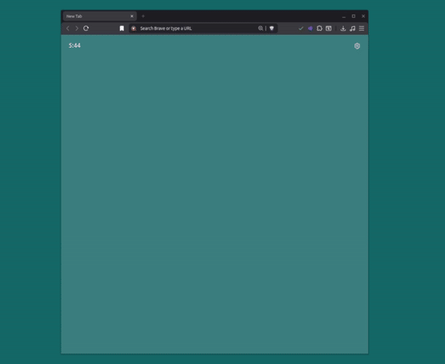
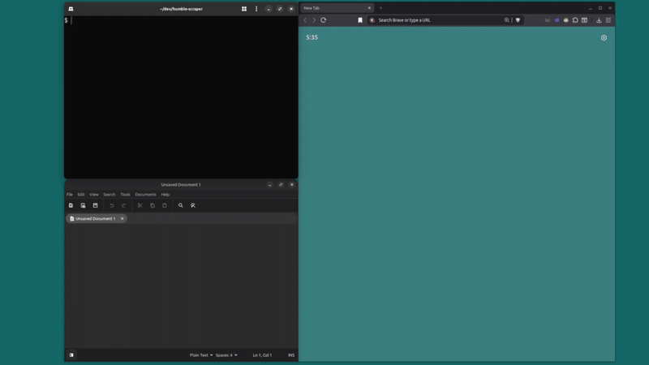

# Humble Choice Webscraper
For anyone who needs to document all of their Humble Bundle games. This whole thing is janky but I love it.

This webscraping process relies on a few things:
- A Chromium based browser
	- A custom extension to be installed on this browser
- A basic text editor
- Admin permissions
	- This is due to the Python script using your keyboard... a lot

# Installing the extension
this script relies on a custom chrome extension to be installed in your browser beforehand.

In your browser you are going to navigate to wherever you manage extensions.  After that you are going to toggle Developer mode to ON.

Once you are in Developer mode you should see a button to load an unpacked extension. Click on it and route it to the Extension folder wherever you cloned this repository.

This extension only affects the Humble Bundle membership page and is active automatically. So whenever you aren't using this script I recommend you turn it off.

# Other requirements/config
- info.json needs to contain the oldest URL of your membership games.
	- This is already configured for Matt :)
- Your browser must be on your main monitor.
	- Everything else can be located wherever.
- You must already be logged into your Humble Bundle account in your browser
- The extension must be enabled

# putting it all together
The python script may ask for admin permissions upon trying to run it, allow them.

Hold 'q' once the script starts if you need to force quit.

Follow the scripts instructions:

